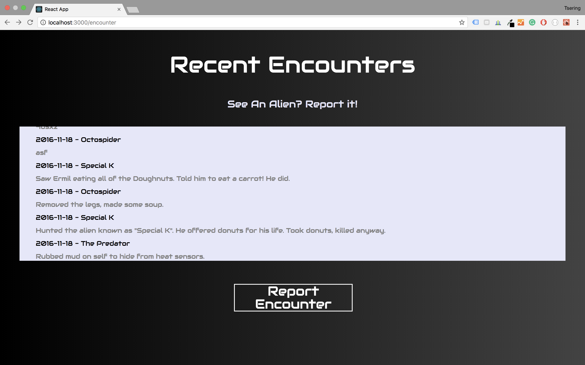
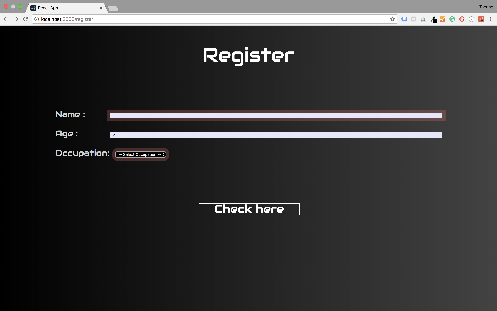

# Mars Colony App (React)
- Implement React Router - Contain routes for all the views - Implement appropriate user feedback when a component is loading - Utilize stateful/stateless components
- Single Page Application

## Download folder
```bash
$npm install 
$npm start
```

## Desktop

 

## Technologies Used
```bash
* JavaScript 
* JSX
* AXIOS
* Postman
* API'
```
